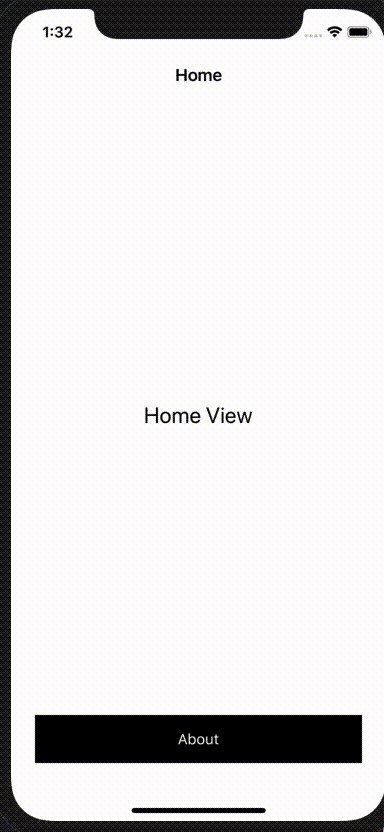

# SwiftBoilerplateTemplate
A Swift (no-storyboard) boilerplate template project, using URLNavigation and Hero for cool transitions

### Install

`pod install`

### Capabilities

* URLNavigation library is handling navigation from one ViewController to another via `Router.swift` where you can define your routes
* `TransparentNavigationVC.swift` is used for more control over the NavigationController
* No-storyboard, but we do love AutoLayout so `UIViewExtensions.swift` contain a set of utilities
* Hero transitions and animations are baked in just use

```
self.navigationController?.hero.navigationAnimationType = .autoReverse(presenting: .cover(direction: .up))

self.navigator.push("app://about", context: nil, from: nil, animated: true)
```
To navigate with style. Available transition animations:
 ```
 .none
 .push(direction: Direction)
 .pull(direction: Direction)
 .cover(direction: Direction)
 .uncover(direction: Direction)
 .slide(direction: Direction)
 .zoomSlide(direction: Direction)
 .pageIn(direction: Direction)
 .pageOut(direction: Direction)
 .fade
 .zoom
 .zoomOut
 ```
 Read more here: https://github.com/HeroTransitions/Hero
 
 ### DataManager
 
 * `DataManager.swift` is an experimental feature that allows the use of KVO on data that is dynamically changing and we need to respond to those changes. By using KVO on a data structure like `VersionNumber.swift` and the launch of a custom event we can respond to changes immediately by changing the UI without having to handle data changes within ViewControllers.
Flow example:
* `AboutVC listens to event `VERSION_CHANGE`
* DataManager singleton has setup KVO on VersionChange data
* When VersionChange is updated, KVO observer fires a `VERSION_CHANGE` event
* AboutVC handles that event and invokes a function to update the UI

This way we are decoupling ViewControllers from their data and the use of generic ViewControllers becomes a simple task of changing the event they listen to.

### Deep linking

* In order to deep link add appropriate URL Types and handle them through the SceneDelegate file. 
* The url route must also be included on the `Router.swift` and finally call `openDeepLinkURL` on AppDelegate to show the view (you can customize transition animations here)



A sample already exists for `quickstart://about` url scheme